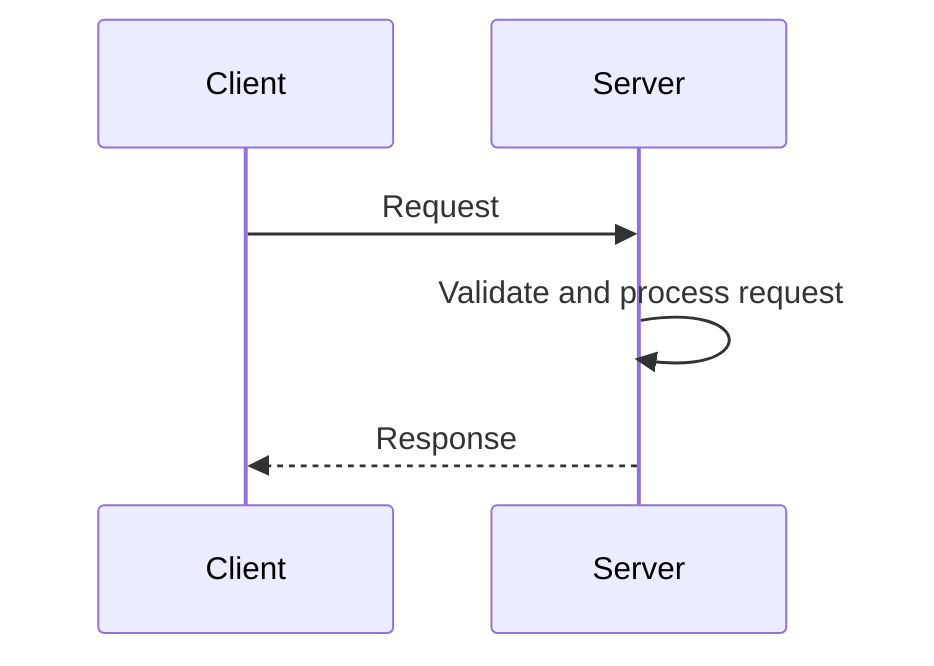
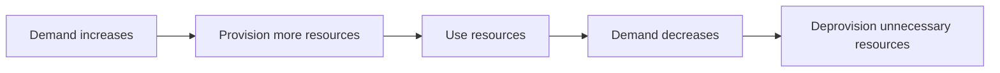

# Welcome to AWS Cloud Practitioner Essentials

## Learning Objective

- Describe the **client-server model** at a fundamental level.

---

## Overview

AWS provides a wide range of cloud services that can support different business needs, including:

- Compute
- Storage
- Databases
- Content delivery
- Generative AI
- Other specialized services

This lesson introduces two foundational concepts:

1. The **client-server model**
2. The idea of paying for AWS resources based on usage

---

# Client-Server Model

The **client-server model** is a fundamental computing concept.

A **client** sends a request to a **server**. The server processes the request and returns a response.

## How It Works

1. A client makes a request.
2. The server receives the request.
3. The server validates and processes the request.
4. The server returns a response.

## Example

A user requests information from an application.

- **User/Application** → Client
- **System handling the request** → Server
- **Requested information or result** → Response

In AWS, a server can be a **virtual server**.

---

# Coffee Shop Analogy

The lesson uses a coffee shop to explain the client-server model:

| Coffee Shop | Computing |
|---|---|
| Customer | Client |
| Barista | Server |
| Coffee order | Request |
| Coffee | Response |

The customer makes an order. The barista processes the order and returns the requested coffee.

Similarly, a client sends a request to a server, and the server returns a response.

---

# Using Resources When Needed

Cloud resources can be provisioned when they are needed and deprovisioned when they are no longer needed.

This flexibility helps organizations adjust resources based on demand.

---

# Key Takeaways

- The **client-server model** is a fundamental computing concept.
- A **client sends a request** to a server.
- A **server processes the request** and returns a response.
- AWS provides a broad range of cloud services.
- Cloud resources can be provisioned when needed and deprovisioned when no longer needed.
- AWS pricing can be based on resource usage.

---

## Important Terms

- **Client:** A user, device, or application that sends a request.
- **Server:** A system that receives and processes requests.
- **Request:** A demand sent from a client to a server.
- **Response:** The result returned by a server.
- **Provision:** Create or make resources available.
- **Deprovision:** Remove resources that are no longer needed.
