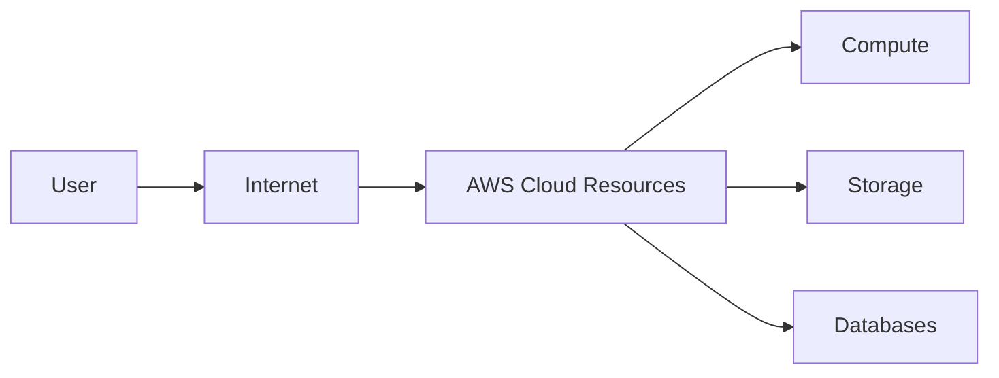
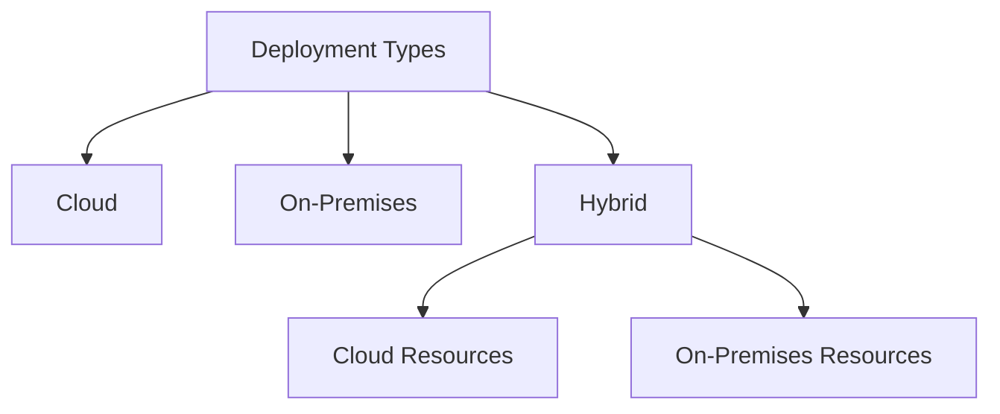

# What Is Cloud Computing?

## Learning Objectives

- Define **cloud computing**.
- Describe and differentiate between **cloud deployment types**.

---

# What Is Cloud Computing?

> **Cloud computing is the on-demand delivery of IT resources over the internet with pay-as-you-go pricing.**

Let's break this definition into parts.

---

## 1. On-Demand

**On-demand** means resources can be used when they are needed.

Examples of IT resources include:

- Compute
- Storage
- Databases
- Networking

Instead of purchasing all infrastructure in advance, resources can be used according to current needs.

---

## 2. Delivery of IT Resources

Applications, data, and workloads need IT infrastructure to operate.

Traditionally, businesses operated applications in their own data centers or used shared facilities.

A **data center** is a building or group of buildings that houses IT infrastructure such as servers.

Data centers use infrastructure such as:

- Power
- Cooling
- Networking
- Security

AWS allows customers to use computing resources in AWS-managed infrastructure instead of owning all of the physical infrastructure themselves.

---

## 3. Over the Internet

Cloud resources can be accessed remotely through an internet connection.

For example, customers can access and manage AWS resources through their AWS account and a web browser.

---

## 4. Pay-As-You-Go Pricing

Pay-as-you-go pricing means costs are related to resource usage.

When a resource is no longer needed, it can be deprovisioned.

---

# Brief AWS History

According to this lesson:

- In the early 2000s, Amazon developed standardized tools and mechanisms to make its IT operations more efficient and scalable.
- AWS began offering infrastructure resources that businesses could use on demand.
- In November 2004, AWS launched Amazon Simple Queue Service (Amazon SQS), described in the lesson as its first public infrastructure service.
- AWS later launched services including Amazon Simple Storage Service (Amazon S3) and Amazon Elastic Compute Cloud (Amazon EC2).
- AWS expanded to provide services such as databases, networking, analytics, and other cloud-based services.

> For this course, the most important point is understanding **why cloud computing exists and how on-demand resources work**.

---

# Cloud Deployment Types

The lesson introduces three deployment types:

## 1. Cloud

Resources are deployed using cloud infrastructure.

## 2. On-Premises

Resources are deployed in infrastructure that an organization operates on its own premises.

## 3. Hybrid

A hybrid approach combines cloud and on-premises resources.

---

# Cloud vs Traditional Infrastructure

| Traditional On-Premises | Cloud Computing |
|---|---|
| Organization manages physical infrastructure | Cloud provider manages underlying cloud infrastructure |
| Hardware planning is required | Resources can be requested as needed |
| Larger upfront infrastructure investment may be required | Usage-based pricing models are available |
| Physical infrastructure must be operated and maintained | Teams can use provider-managed infrastructure |

---

# Key Takeaways

- Cloud computing is the **on-demand delivery of IT resources over the internet with pay-as-you-go pricing**.
- IT resources can include compute, storage, databases, and networking.
- Cloud resources can be accessed remotely.
- AWS enables customers to use IT resources without owning all of the underlying physical infrastructure.
- The three deployment types introduced are **cloud, on-premises, and hybrid**.

---

## Important Terms

- **Cloud computing:** On-demand delivery of IT resources over the internet with pay-as-you-go pricing.
- **Data center:** A facility that houses IT infrastructure such as servers.
- **On-demand:** Resources are used when needed.
- **On-premises:** Infrastructure operated by an organization on its own premises.
- **Hybrid:** A combination of cloud and on-premises resources.
- **Deprovision:** Remove resources that are no longer needed.
