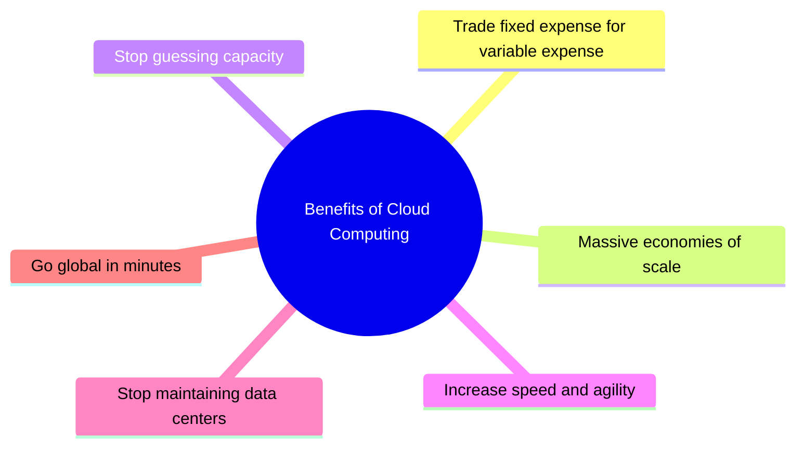
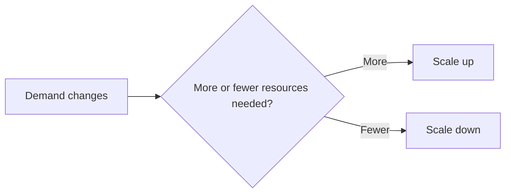
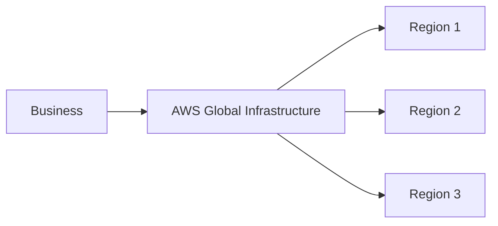

# Benefits of the AWS Cloud

## Learning Objective

- Describe the **six key benefits of cloud computing**.

---

# The Six Key Benefits

AWS identifies six major benefits of cloud computing:

1. Trade fixed expense for variable expense
2. Benefit from massive economies of scale
3. Stop guessing capacity
4. Increase speed and agility
5. Stop spending money running and maintaining data centers
6. Go global in minutes

---

# 1. Trade Fixed Expense for Variable Expense

## Traditional Approach

Building an on-premises data center can require significant upfront investment in:

- Physical space
- Hardware
- Staff
- Maintenance

These costs can remain fixed regardless of how much infrastructure is actually being used.

## Cloud Approach

With usage-based cloud pricing, costs can vary according to the amount of resources consumed.

### Key Idea

> Move from large fixed infrastructure investments toward costs that are more closely aligned with actual usage.

---

# 2. Benefit from Massive Economies of Scale

AWS operates infrastructure at a large global scale.

The lesson compares this concept to buying products in bulk: purchasing at larger volumes can reduce the cost per unit.

AWS can use its large-scale infrastructure to provide cloud services to different types of organizations, including:

- Startups
- Small businesses
- Large enterprises

---

# 3. Stop Guessing Capacity

Traditional infrastructure requires organizations to estimate future demand and purchase enough hardware to support it.

This can create two problems:

## Overestimating

The organization purchases more infrastructure than it eventually needs.

## Underestimating

The organization does not have enough capacity when demand grows.

Cloud resources can be scaled according to demand.

### Key Idea

> Use resources based on actual demand instead of purchasing all capacity far in advance.

---

# 4. Increase Speed and Agility

Cloud computing allows teams to create resources and test ideas more quickly.

For example, a team can:

1. Create a test environment.
2. Run an experiment.
3. Evaluate the result.
4. Remove the resources if they are no longer needed.

This can help teams spend more time on:

- Innovation
- Experimentation
- Optimization

---

# 5. Stop Spending Money Running and Maintaining Data Centers

Operating a physical data center involves more than purchasing servers.

Organizations may need to manage:

- Physical servers
- Power
- Facilities
- Hardware maintenance
- Ongoing infrastructure operations

With AWS, AWS manages the physical cloud infrastructure.

This allows customer teams to focus more on their applications, customers, and business goals.

---

# 6. Go Global in Minutes

Expanding traditional infrastructure into another geographic area can require building or operating infrastructure in that location.

AWS provides global infrastructure that customers can use to deploy applications in different geographic areas.

### Key Idea

> AWS customers can use existing AWS global infrastructure instead of building their own infrastructure in every location.

---

# Summary Table

| Benefit | Main Idea |
|---|---|
| Trade fixed expense for variable expense | Align costs more closely with usage |
| Massive economies of scale | Benefit from large-scale cloud infrastructure |
| Stop guessing capacity | Scale resources according to demand |
| Increase speed and agility | Quickly create resources and experiment |
| Stop maintaining data centers | AWS manages physical cloud infrastructure |
| Go global in minutes | Use AWS infrastructure in different geographic areas |

---

# Key Takeaways

- Cloud computing can reduce the need for large upfront infrastructure investments.
- Cloud resources can be adjusted according to demand.
- Teams can experiment and deploy more quickly.
- AWS manages physical cloud infrastructure.
- AWS global infrastructure helps customers deploy applications in different geographic areas.

---

## Exam Revision ⭐

Remember the **six benefits**:

> **Fixed → Variable → Scale → Agility → No Data Center Maintenance → Global**

Do not rely only on the mnemonic; understand what each benefit means.
