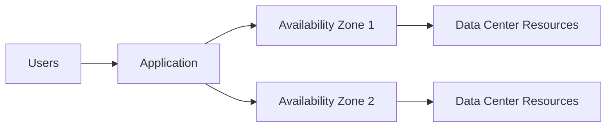
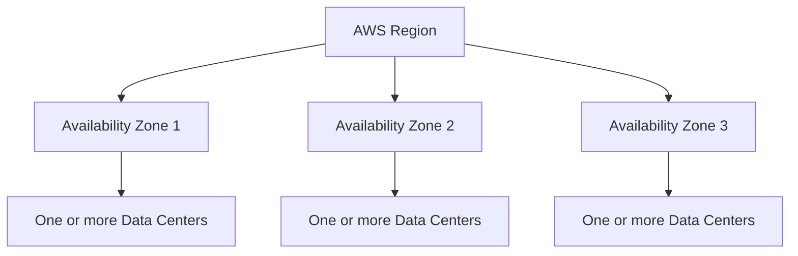
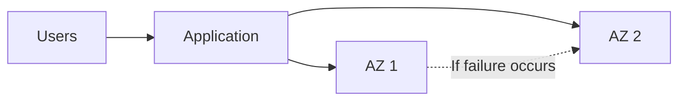
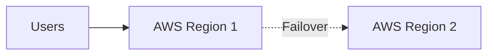

# Introduction to AWS Global Infrastructure

## Learning Objectives

- Define **AWS Regions** and **Availability Zones (AZs)**.
- Explain the benefits of **high availability** and **fault tolerance**.

---

# Why Global Infrastructure Matters

AWS operates infrastructure in different geographic areas.

Using only one location can create risk. If a single location experiences a problem, applications running only in that location may become unavailable.

AWS Global Infrastructure helps customers design systems with redundancy.

---

# High Availability

**High availability** is about keeping applications accessible with minimal downtime.

If one component fails, another component can help keep the service running.



---

# Fault Tolerance

**Fault tolerance** goes further by designing a system to continue operating even when components fail.

The goal is to build resilience so that a single failure does not bring down the entire system.

---

# AWS Regions

An **AWS Region** is a geographic area where AWS has infrastructure.

The lesson gives examples such as:

- Paris
- Tokyo
- São Paulo
- Dublin
- Ohio

Regions help AWS provide infrastructure in different geographic locations.

---

# Availability Zones (AZs)

Within an AWS Region are **Availability Zones**, commonly called **AZs**.

According to this lesson:

- A Region contains three or more AZs for redundancy.
- AZs are isolated from one another.
- AZs are not built immediately next to each other.
- An AZ contains one or more discrete data centers.
- AZs have redundant power, networking, and connectivity.



---

# Region, Availability Zone, and Data Center

```text
AWS Global Infrastructure
        |
        └── AWS Region
              |
              ├── Availability Zone (AZ)
              |      └── One or more Data Centers
              |
              ├── Availability Zone (AZ)
              |      └── One or more Data Centers
              |
              └── Availability Zone (AZ)
                     └── One or more Data Centers
```

---

# Achieving High Availability

A common approach is to distribute resources across multiple Availability Zones.

If one AZ encounters an outage, resources in another AZ can help keep applications operating.



### Key Principle

> Redundancy and resource isolation help customers design for high availability and fault tolerance.

---

# Multiple Regions

For additional resilience, businesses may operate across multiple AWS Regions.

The lesson explains that if one Region experiences an outage, operations can fail over to another Region.



The course notes that this topic will be explored in greater depth later.

---

# Coffee Shop Analogy

The lesson compares multiple AWS locations to a coffee shop chain.

If one coffee shop closes because of a problem, customers can visit another location.

Similarly, redundancy across infrastructure locations can help keep services available when a component or location experiences a problem.

---

# Key Takeaways

- AWS operates infrastructure in geographic **Regions**.
- Each Region contains multiple **Availability Zones (AZs)**.
- AZs are isolated from one another for redundancy.
- An AZ contains one or more data centers.
- **High availability** focuses on keeping applications accessible with minimal downtime.
- **Fault tolerance** focuses on continuing operation even when failures occur.
- Distributing resources across multiple AZs can improve resilience.

---

## Important Terms

- **AWS Region:** A geographic area containing AWS infrastructure.
- **Availability Zone (AZ):** An isolated infrastructure location within an AWS Region.
- **Data Center:** A facility that houses IT infrastructure.
- **High availability:** Designing applications to remain accessible with minimal downtime.
- **Fault tolerance:** Designing systems to continue operating despite failures.
- **Redundancy:** Having additional components or resources to reduce the impact of failures.
- **Failover:** Moving operations to another available location or system when a failure occurs.
