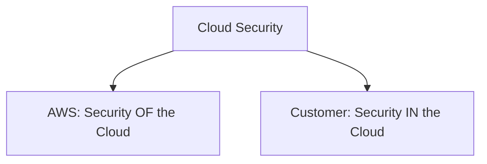
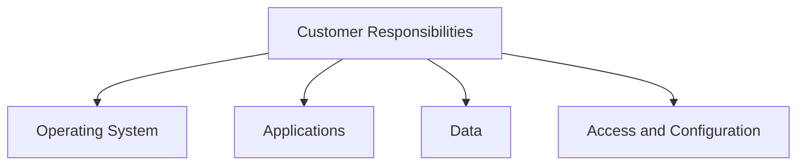

# The AWS Shared Responsibility Model

## Learning Objectives

- Differentiate between **AWS responsibilities**, **customer responsibilities**, and **shared responsibilities**.
- Describe the components of the AWS Shared Responsibility Model.

---

# What Is the AWS Shared Responsibility Model?

The **AWS Shared Responsibility Model** explains how AWS and customers work together to create a secure cloud environment.

Both AWS and the customer have security responsibilities.

The central idea is:

> **AWS is responsible for security of the cloud.**

> **Customers are responsible for security in the cloud.**



---

# AWS: Security OF the Cloud

AWS is responsible for securing the underlying infrastructure that supports AWS services.

The lesson identifies responsibilities such as:

- Physical infrastructure
- Network layer
- Hypervisor virtualization layer

## Physical Layer

The physical layer includes the physical infrastructure used to operate computing systems.

Security can involve controls that protect physical hardware and infrastructure.

---

# Customer: Security IN the Cloud

Customers are responsible for securing what they run and manage in the AWS environment.

The lesson discusses customer responsibilities including:

- Operating systems
- Applications
- Data
- Access management and configuration
- Applying operating system patches



---

# Operating System Responsibility

For an operating system managed by the customer, the customer is responsible for tasks such as:

- Managing access
- Managing user accounts
- Applying patches

The lesson uses a house analogy:

- A builder is responsible for building strong walls and doors.
- A homeowner is responsible for closing and locking the door.

Similarly, AWS secures the underlying cloud infrastructure, while customers secure the resources and workloads they manage.

---

# Application Responsibility

Customers are responsible for the applications they run.

This includes ensuring that applications are appropriately secured.

---

# Data Responsibility

Customers control their data and decide who should have access.

Depending on the use case, data may need to be:

- Available to many users
- Available only to authorized users
- Restricted to specific users or conditions

Customers can also use encryption to protect data.

---

# Responsibilities Can Vary by Service

The lesson emphasizes an important point:

> **Responsibilities can shift depending on the AWS service being used.**

As the course introduces different AWS services, the specific responsibilities for AWS and customers can vary.

---

# Simple Responsibility Diagram

```text
                 AWS Shared Responsibility Model

        AWS                                   Customer
        ───                                   ────────
        Security OF the cloud                 Security IN the cloud

        • Physical infrastructure             • Operating systems
        • Network infrastructure              • Applications
        • Hypervisor layer                    • Data
                                              • Access and configuration
                                              • Patching (where applicable)
```

---

# Key Takeaways ⭐

- Security in AWS is a **shared responsibility**.
- AWS is responsible for **security of the cloud**.
- Customers are responsible for **security in the cloud**.
- Customer responsibilities can include operating systems, applications, and data.
- Responsibilities can change depending on the AWS service being used.

---

## Important Exam Concept ⭐⭐⭐

Remember:

> **AWS = Security OF the Cloud**

> **Customer = Security IN the Cloud**

Also remember that the exact division of responsibilities can vary depending on the service.
