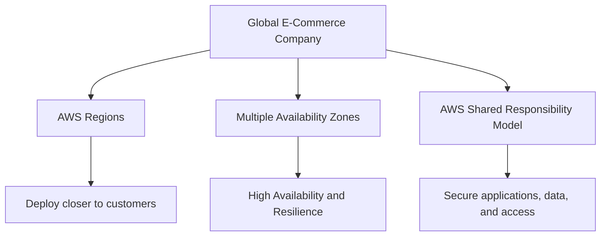
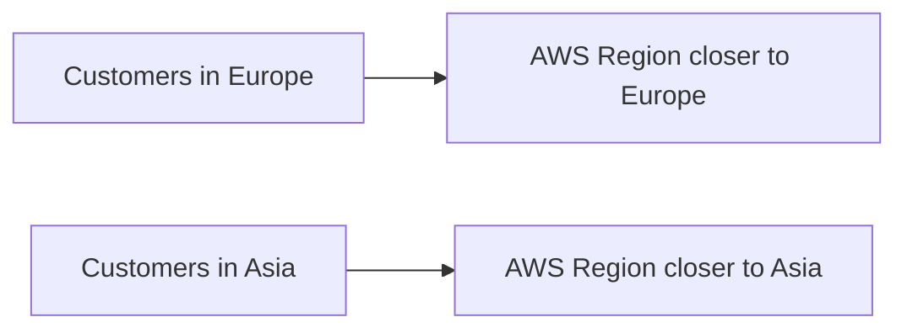
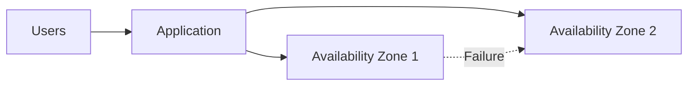
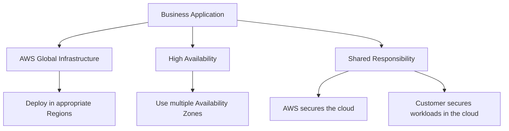

# Applying Cloud Concepts to Real Life Use Cases

## Learning Objective

- Explain how fundamental cloud concepts work together to form real-world business solutions.

---

# Cloud Concepts Work Together

Cloud concepts should not be viewed as completely separate ideas.

In real-world solutions, concepts such as:

- AWS Global Infrastructure
- AWS Regions
- Availability Zones
- High availability
- Fault tolerance
- AWS Shared Responsibility Model

can work together.

---

# Real-World Example: Global E-Commerce Company

The lesson uses an example of an e-commerce company that wants to expand globally.

The company can use AWS infrastructure to:

1. Deploy applications closer to customers.
2. Use multiple Availability Zones for resilience.
3. Focus on securing its applications, data, and access.
4. Use AWS-managed physical infrastructure.

---

# 1. AWS Regions and Latency

The lesson explains that infrastructure located farther from customers can increase latency for customer requests.

A business with customers in different parts of the world can choose AWS Regions that are closer to its customer base.

The example in the lesson includes:

- `eu-west-1` in Ireland
- `ap-southeast-1` in Singapore

---

# 2. Global Reach for Businesses

AWS Global Infrastructure can help businesses reach customers in different geographic areas.

This can be especially useful for:

- Startups
- Small companies
- Growing businesses
- Global organizations

Businesses can use existing AWS infrastructure instead of building all physical infrastructure themselves.

---

# 3. Multiple Availability Zones

An application can be designed to use multiple Availability Zones.

The lesson describes deploying the same configuration in at least two AZs so that if one location fails, another can support continued operation.

This is part of designing for:

- High availability
- Fault tolerance
- Resilience

---

# 4. Shared Responsibility and Security

The AWS Shared Responsibility Model helps organizations understand which security tasks belong to AWS and which belong to the customer.

For the e-commerce company:

## AWS

AWS is responsible for **security of the cloud**, including the underlying infrastructure.

## Customer

The customer focuses on **security in the cloud**, including areas such as:

- Data security
- Managing access
- Secure application configuration
- Meeting relevant compliance requirements

---

# Putting Everything Together

---

# Key Takeaways

- AWS services and cloud concepts work together to create business solutions.
- AWS Regions can help businesses deploy infrastructure closer to customers.
- Multiple Availability Zones can help improve application resilience.
- High availability and fault tolerance are important when designing reliable systems.
- AWS manages security **of the cloud**.
- Customers are responsible for security **in the cloud**.
- Cloud infrastructure can help businesses reach a global audience.

---

## Think Like a Cloud Practitioner

When learning a new AWS concept, ask:

1. **What problem does this solve?**
2. **How does it work with other AWS services or concepts?**
3. **Who is responsible for it: AWS, the customer, or both?**
4. **How could this concept be used in a real business?**
